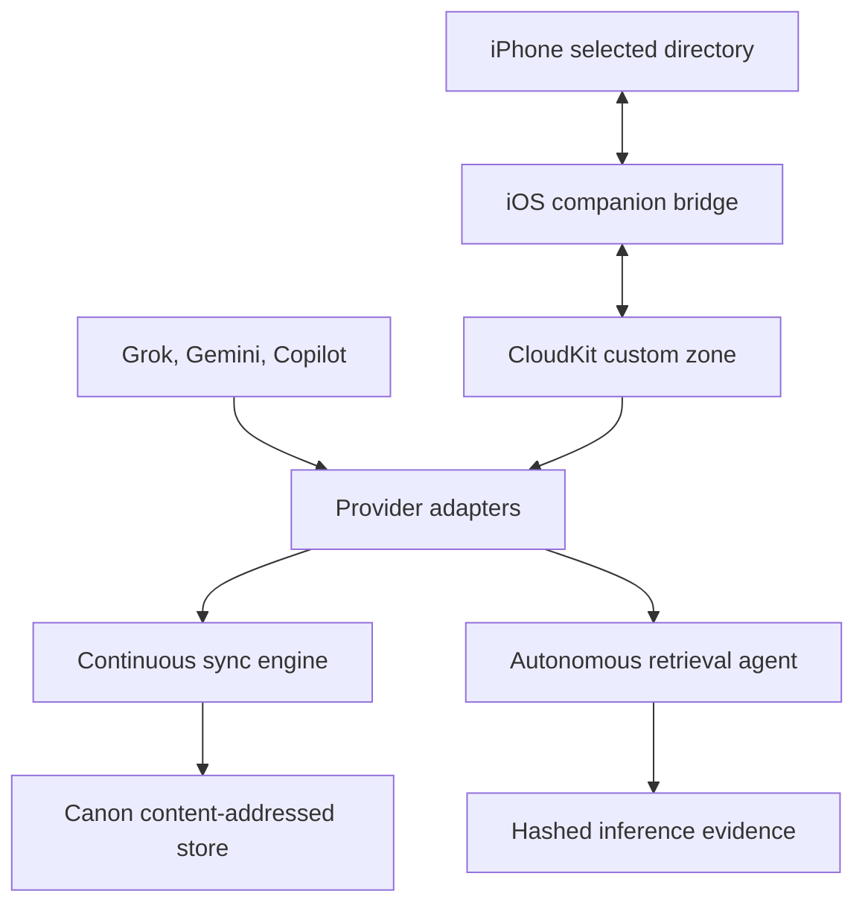

# Canon Provider and iPhone Data Fabric

## Delivered scope

This increment adds governed read/write adapters for xAI Grok, Google Gemini, GitHub Copilot, Apple CloudKit, and user-selected iPhone storage. It also adds a durable continuous sync daemon and an autonomous retrieval agent. Everything is implemented but disabled until a deployment supplies credentials, scope, action grants, and explicit write/inference switches.

| Adapter | Read | Write | AI/retrieval | Hard boundary |
|---|---|---|---|---|
| Grok | xAI Files metadata and file bytes | Immutable file upload; optional collection attachment | Responses API with collection file search | No private `grok.com` consumer chat-history access; collection mutation uses a separately scoped management key |
| Gemini | Gemini Files or File Search document metadata | Resumable file upload and optional File Search import | Interactions API with File Search and citations | Original uploaded bytes are metadata-only through this adapter because the Files API does not expose a raw download operation |
| Copilot | SDK-persisted session list and events | Create a new session or append to an existing session | Conversation inference over an optional session | Does not cover every IDE/web Copilot surface; adapter-managed sessions deny tools by default |
| iCloud | CloudKit custom-zone record changes and CKAsset bytes | Record create/update with change-tag conflict checks | Continuous change-token retrieval | Limited to the configured app container/database, not arbitrary access to a user’s full iCloud Drive |
| iPhone local | App container or user-picked Files directory | Scoped create/update with atomic file coordination and hash conflict checks | Changed documents relay through CloudKit | iOS sandbox applies; no whole-phone storage access and background execution is best effort |

Official surface references: [xAI Files and Collections](https://docs.x.ai/developers/files/collections/api), [xAI file management](https://docs.x.ai/developers/rest-api-reference/files/manage), [xAI collection search](https://docs.x.ai/developers/tools/collections-search), [Gemini Files](https://ai.google.dev/gemini-api/docs/files), [Gemini File Search](https://ai.google.dev/gemini-api/docs/file-search), [Gemini Interactions](https://ai.google.dev/gemini-api/docs/interactions-overview), [Copilot SDK](https://docs.github.com/en/copilot/how-tos/copilot-sdk/getting-started), [Copilot session persistence](https://docs.github.com/en/copilot/how-tos/copilot-sdk/features/session-persistence), [Apple directory access](https://developer.apple.com/documentation/uikit/providing-access-to-directories), [Apple background strategy](https://developer.apple.com/documentation/backgroundtasks/choosing-background-strategies-for-your-app), and [CloudKit Web Services setup](https://developer.apple.com/library/archive/documentation/DataManagement/Conceptual/CloudKitWebServicesReference/SettingUpWebServices.html).

## Architecture



Provider content is untrusted data. Retrieval prompts explicitly treat indexed documents as evidence rather than executable instructions. Canon grants, not document text or a model response, determine authority.

## Install and validate

Use Node.js 22 or newer. The Copilot SDK is optional so the other adapters can be deployed without it.

```bash
npm install
npm install @github/copilot-sdk   # only for the Copilot adapter
npm run validate
```

For Copilot, authenticate the Copilot CLI using the deployment identity and subscription required by GitHub. The SDK session store is the supported surface; the adapter does not scrape IDE storage. GitHub documents the SDK’s default deny behavior and compatibility requirements in its [compatibility guidance](https://docs.github.com/en/copilot/how-tos/copilot-sdk/troubleshooting/compatibility).

Copy only the needed variables from `.env.example` into a secret-injected deployment environment. Set `CANON_SYNC_ADAPTERS` to the configured subset; selecting all adapters requires all corresponding credentials.

## Continuous document and data retrieval

Choose an absolute private directory that is not a filesystem root. Read sync does not require either mutation switch.

```bash
export CANON_SYNC_ADAPTERS=grok,gemini
export CANON_SYNC_ROOT=/srv/canon/provider-sync
export CANON_ENABLE_WRITES=false
export CANON_ENABLE_INFERENCE=false
npm run sync:once
npm run sync:daemon
```

The daemon stores:

- `objects/`: SHA-256-addressed content bytes;
- `records/`: normalized source metadata and provenance;
- `checkpoints/`: opaque provider cursors;
- `receipts/`: per-item ingest receipts;
- `run-receipts.jsonl`: sync-run summaries;
- `dead-letters/`: bounded, redacted failure records.

The cursor is committed after a complete page only. A failed item is retried on the next run rather than silently skipped.

## Writes

Set `CANON_ENABLE_WRITES=true` only in a deployment that issues short-lived `ActionGrant` objects. A grant must match the adapter, operation, resource prefix, payload size, validity window, and approval reference. Updates require a matching approval reference by default. Deletion is unsupported.

Provider destination formats are:

| Adapter | Create destination | Update destination |
|---|---|---|
| Grok | `collection:collection_id` or another explicitly granted non-collection namespace | Unsupported; upload a new immutable file |
| Gemini | `fileSearchStores/store_id` for upload plus import | Unsupported; upload a new immutable file |
| Copilot | `session:new` | `session:session_id` |
| CloudKit | `record:record_name` | `record:record_name` plus `expectedVersion` |
| iPhone | Relative path below a selected root | Relative path plus optional expected SHA-256; updates require approval |

Provider-native permissions still apply. The adapter cannot turn a read-only credential into a writer.

## Autonomous AI retrieval

Start from `config/canon-retrieval-jobs.example.json`, replace the placeholder resource and issue a fresh, short-lived grant. The jobs file is schema-validated before execution.

```bash
export CANON_ENABLE_INFERENCE=true
export CANON_RETRIEVAL_JOBS_FILE=/srv/canon/config/retrieval-jobs.json
npm run retrieve:once
npm run retrieve:daemon
```

Each successful run stores the provider receipt, provider response ID, citations, prompt hash, output hash, and output under `inference-evidence/`. Cadence state prevents a job from running more frequently than configured. Set `CANON_REQUIRE_INFERENCE_APPROVAL=true` when the deployment requires a matching approval reference for every inference.

## CloudKit and iPhone setup

1. Create a dedicated CloudKit container and keep development and production separate.
2. For private/shared Web Services access, obtain a delegated user web-auth token; do not treat the container API token as user authorization. Apple describes zone-change tokens in [Fetching Record Zone Changes](https://developer.apple.com/library/archive/documentation/DataManagement/Conceptual/CloudKitWebServicesReference/FetchingRecordZoneChanges%28changeszone%29.html) and record writes in [Modifying Records](https://developer.apple.com/library/archive/documentation/DataManagement/Conceptual/CloudKitWebServicesReference/ModifyRecords.html).
3. Build an iOS 17+ app around `mobile/CanonPhoneBridge`. Replace the example container ID, enable CloudKit/iCloud Documents, add the background processing identifier, and present a folder picker.
4. Use `SecurityScopedRootStore` to persist the user’s selected directory, then create `LocalDocumentAdapter`, `CloudKitSyncAdapter`, and `PhoneSyncCoordinator`.
5. Run a foreground canary first. Register `BackgroundSyncScheduler` only after the same CloudKit zone and record schema pass read/write tests.

Server-to-device writes must use `CloudKitDataAdapter.writePhoneInstruction()`. That typed path projects the device operation, root/action-grant IDs, relative path, expiry timestamp, idempotency key, expected local hash, and approval reference into first-class CloudKit fields before uploading the asset. Update instructions require both approval and an expected SHA-256 and may expire no more than 24 hours after issuance.

CloudKit record types are:

| Record type | Direction | Purpose |
|---|---|---|
| `CanonDocument` | iPhone → CloudKit → Canon | Changed local document plus hash, relative path, origin, metadata, and CKAsset |
| `CanonWriteInstruction` | Canon → CloudKit → iPhone | Expiring, grant-bound create/update request with payload asset |
| `CanonWriteReceipt` | iPhone → CloudKit → Canon | Device write outcome, hash, approval reference, and idempotency key |

iOS controls background scheduling; it cannot guarantee an always-running process. Treat device sync as eventually consistent and surface stale-device health separately.

## Deployment verification gate

Before changing an integration from sandbox/tested to verified:

1. Run the full repository validation suite.
2. Call each selected adapter’s `healthCheck()` with a least-privilege canary identity.
3. Verify one bounded read and one disposable create; verify an update conflict where supported.
4. Revoke or expire the grant and prove further writes/inference fail closed.
5. Inject a read or sink failure and prove the sync cursor does not advance.
6. Confirm logs and receipts contain no API keys, bearer tokens, CloudKit web-auth token, or raw prompt.
7. For iPhone, revoke the selected-directory grant and verify local access stops.
8. Record live evidence and independent acceptance before assigning `VERIFIED`.

The automated suite in this repository uses deterministic mock transports. It proves adapter behavior and failure controls, not live vendor entitlement or production readiness.
